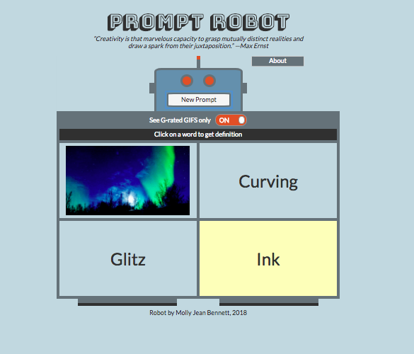

<h1>PromptRobot</h1>

<a href="https://promptrobot.herokuapp.com/">Prompt Robot</a> is a responsive web app that uses the GIPHY API and the Words API to generate writing prompts for writers and creative writing teachers. This project was built with HTML5, CSS3, JavaScript, jQuery, and Node.js.

<h2>Introduction</h2>

Surrealist artist Max Ernst wrote that creativity is "that marvelous capacity to grasp mutually distinct realities and draw a spark from their juxtaposition." This app randomizes over large quantities of data to pull a GIF and a set of three words that aim to surprise and inspire through such a juxtaposition. While testing a prototype of the app, one high school English teacher said that Prompt Robot would be a visually engaging way to get beginning writers in his classroom interested in starting new projects.

<h2>User Summary</h2>
<ul>
<li>When a user opens the app, the robot is empty and intro text below the header explains the app and prompts the user to click the 'New Prompt' button.</li>

<li>A user can select whether they wish to see only g-rated GIFs via a toggle switch.</li>

<li>Once the button is clicked, a GIF, an adjective, a noun, and a verb appear in the content boxes. The GIF data is fetched via GIPHY's randomizing endpoint, with a randomized tag word from a bank sent as a parameter. Each word is fetched through a separate API call via a web server. Each call sends a different part of speech as a parameter.</li>

<li>When a user mouses over a word, the box is highlighted. When a user clicks on a word, a separate tab opens with the dictionary.com definition of that word.</li>q
</ul>
<h2>API Information</h2>

To learn more about the dictionary API used in this project, visit https://www.wordsapi.com/

And for GIPHY's API documentation, see https://developers.giphy.com/
